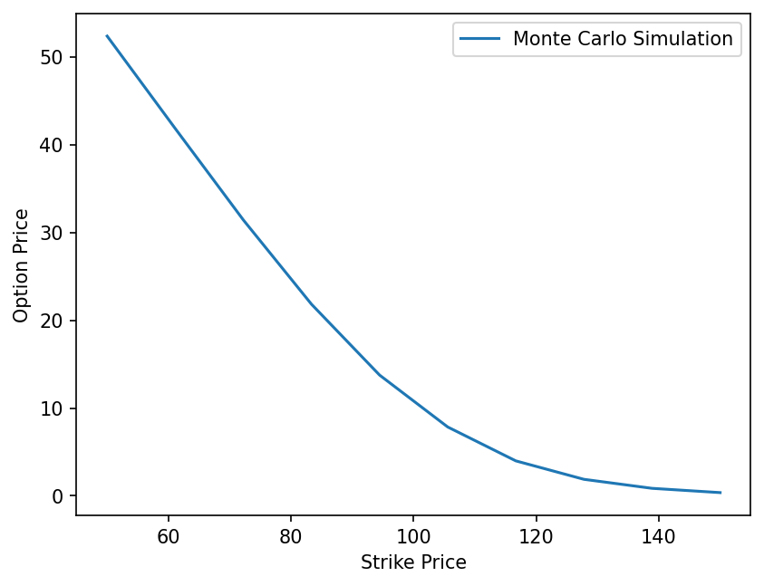

# Monte Carlo Option Pricing

I am creating a project, which uses the Monte Carlo simulation to price European options. I plan to then check this against the Black-Scholes formula, and analyse convergence and variance-reduction techniques. 

## Requirements
NumPy, SciPy, Matplotlib

## Installation
Clone the repo and install the dependencies:
    git clone https://github.com/Ham1shP/monte-carlo-option-pricing.git
    cd monte-carlo-option-pricing
    pip install -r requirements.txt

## Using it
Run the script:
    python montecarlo.py

- This will plot option price against strike and save as 'option_price_vs_strike_price.png'
- Plot the standard error against N (log-log scales) and save as 'standard_error_vs_simulations.png'
- Print the fraction of 500 trials whose 95% confidence interval contained the Black-Scholes price, which should be around 0.95.

## So far

So far, I have used the vanilla pricing method with Monte Carlo simulation and then verified this with the Black-Scholes formula. Below is a plot showing how strike price affects option price. 

I have then used antithetic variates to reduce the variance of the method, which then means that we need ~2.03 times fewer simulations for the same accuracy in running the program. 

## Author
Hamish Paisley
